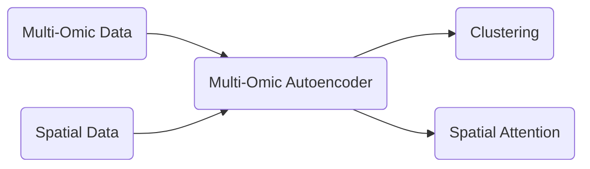
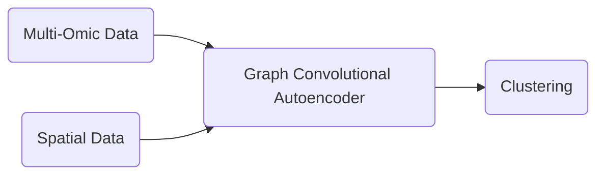
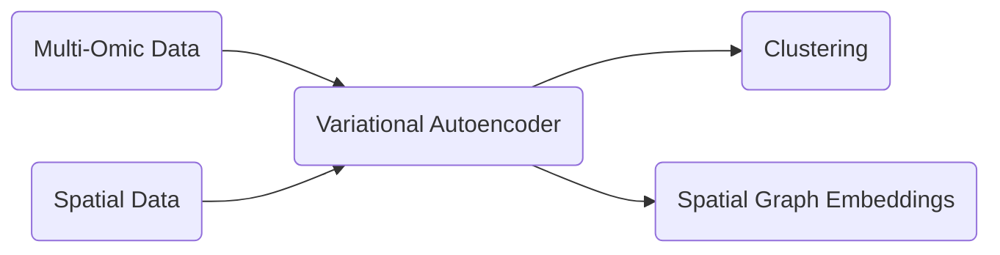
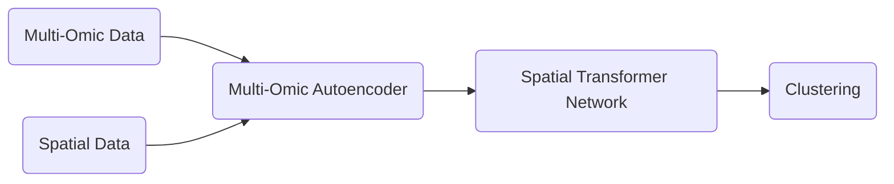
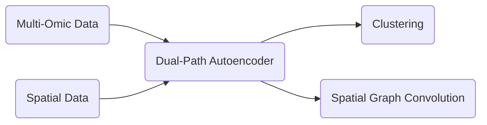
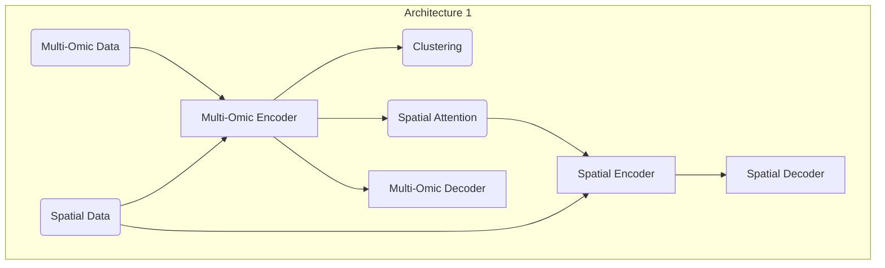
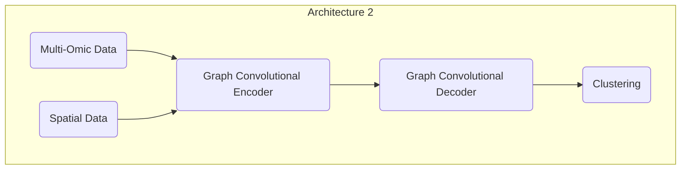
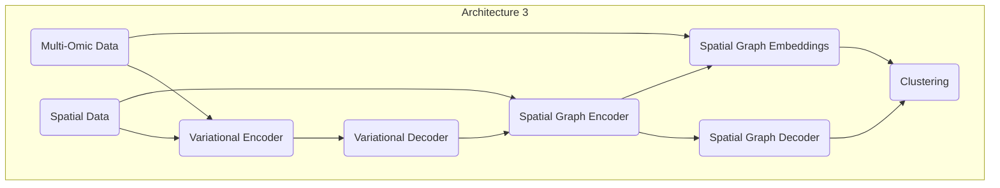
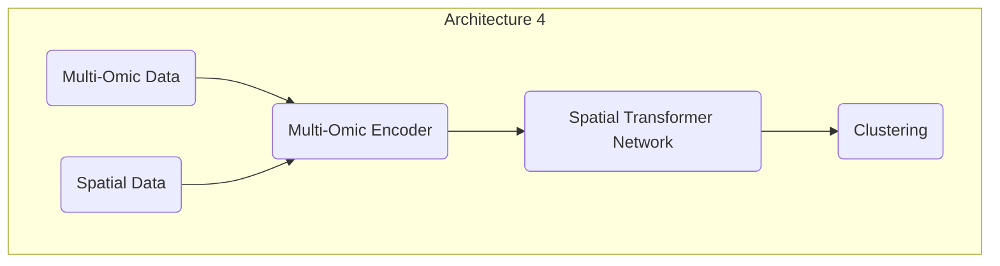
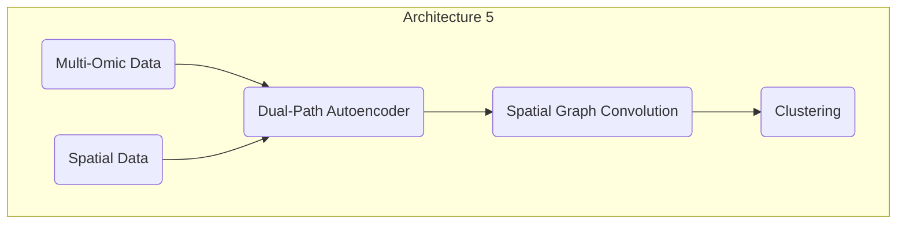

### High Level Diagram :

#### Architecture 1

#### Architecture 2

#### Architecture 3

#### Architecture 4

#### Architecture 5

### Low Level Diagram :

#### Architecture 1

#### Architecture 2

#### Architecture 3

#### Architecture 4

#### Architecture 5

