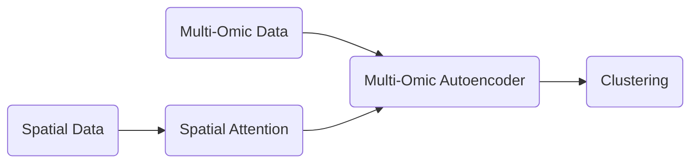
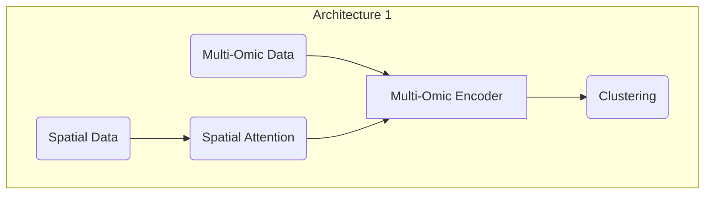
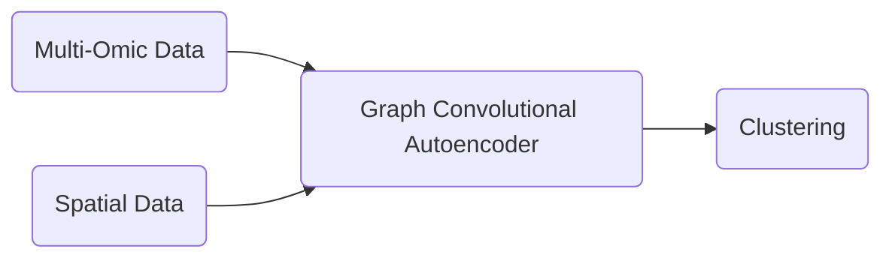
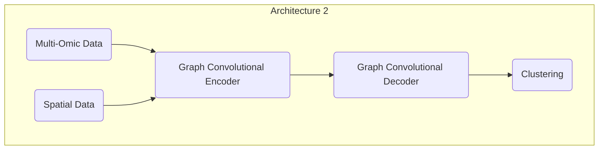
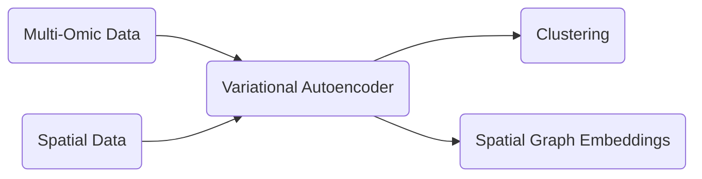
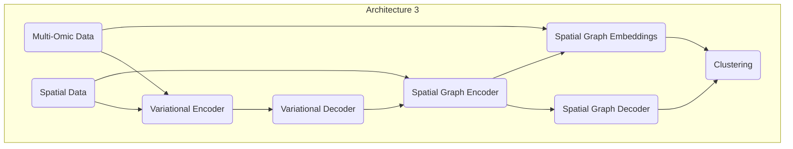
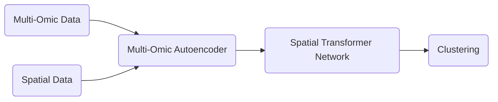
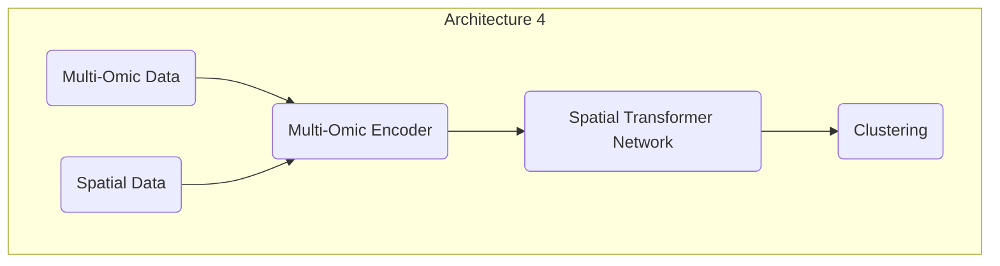
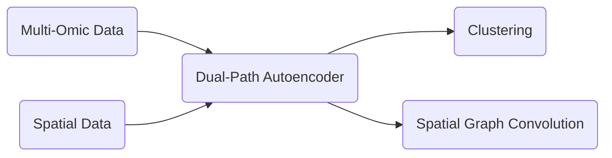
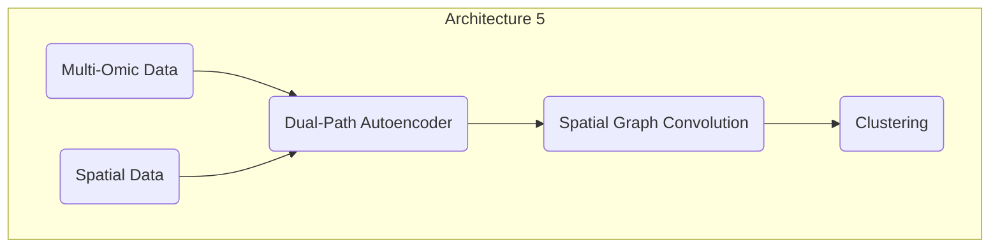

## Architecture 1
*High-Level Diagram:*

*Low-Level Diagram:*

**Architecture 1: Multi-Omic Autoencoder with Spatial Attention**  
Multi-omic data is fed into separate autoencoders for each omic type to learn their respective latent spaces. 
Spatial information (e.g., spatial coordinates) is incorporated using a spatial attention mechanism that highlights relevant spatial features. 
The latent representations from the autoencoders and spatial attention module

## Architecture 2
*High-Level Diagram:*

*Low-Level Diagram:*

**Architecture 2: Graph Convolutional Autoencoder with Multi-Omic Inputs**  
Multi-omic data is represented as a graph, where nodes represent samples and edges represent spatial relationships. 
Graph convolutional autoencoders are used to learn latent representations of the multi-omic data while capturing spatial dependencies. 
The latent representations are then used for downstream tasks such as clustering, where spatial relationships contribute to the clustering process. 

## Architecture 3
*High-Level Diagram:*

*Low-Level Diagram:*

**Architecture 3: Variational Autoencoder with Spatial Graph Embeddings**  
Variational autoencoders (VAEs) are employed to model the latent space of each omic type. 
Spatial information is incorporated by constructing a spatial graph, where nodes represent samples and edges encode spatial relationships. 
Graph embedding techniques are applied to learn spatial representations, which are fused with the VAE latent spaces for downstream clustering tasks. 

## Architecture 4
*High-Level Diagram:*

*Low-Level Diagram:*

**Architecture 4: Spatial Transformer Network with Multi-Omic Autoencoders**  
Multi-omic data is processed by individual autoencoders to obtain latent representations. 
Spatial transformer networks (STNs) are used to learn spatial transformations, enabling the model to align and integrate the spatial information. 
The transformed spatial features and the latent representations from the autoencoders are combined and used for spatial clustering tasks. 

## Architecture 5
*High-Level Diagram:*

*Low-Level Diagram:*

**Architecture 5: Dual-Path Autoencoder with Spatial Graph Convolution**  
Dual-path autoencoders are utilized to learn separate latent representations for each omic type while preserving their unique characteristics. 
Spatial information is incorporated through graph convolutional layers, which capture spatial dependencies and encode them in the latent space. 
The fused latent representations and spatial graph convolutions are employed for downstream tasks such as spatial clustering. 
